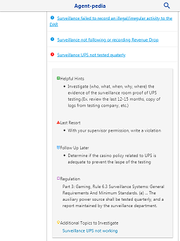

# Agent-pedia

### Screen Shots:

 

### Table of Contents
1.	Project Demo Link
2.	Purpose
3.	Motivation
4. Objectives
5.	Example of Use
6. Features
7.	Technologies Used

### Project Demo Link: [Agent-pedia](https://jcsmileyjr.github.io/agent-guide/)

### Purpose:
Field guide for gaming enforcement agents. Search the gaming regulations by short practical named topics for re-occurring problems. 

### Motivation:
I wanted a tool to list all the different ways to apply the gaming regulation to violations found in the casino. A cheat-sheet to make writing violations easier instead of spending time searching for the rules that was broken. A quick reminder of past strategies that have proven useful based on certain situation.   

### Objectives:
* List re-occurring violations as a short practical name topic
* State the gaming regulation that is being violated
* List the standard operating procedure  associated with the regulation
* State helpful hints on what to do when the problem is identified
* Give examples of additional violations to investigate based on the current violation

### Example of Use:
1.	Click on a topic based on the department responsible for the problem that best fits the current problem being faced. 
2.	Used the regulation provided to help write a violation for the casino
3.	Read the standard operating procedures for actions the agent is required to take. 
4.	Follow the helpful hints in gathering evidence or additional tactics that complement the SOPs. 
5.	During the investigation, look for additional violation listed that are normally group together. 

### Features:
* List of topics organized by casino department

### This app was built with the following technologies:

 **Materialize CSS:** Web development framework for developing responsive, mobile first front-end projects based on Google's Material Design language.
 
 **AngularJS:** JavaScript-based front-end framework for building single page web applications.
 
 **Git-Hub:** web-based version control repository and Internet hosting service
 
 **JavaScript:** object-oriented programming language for web pages
 
 **HTML5:** Mark-up language for creating web pages and local storage of data in the browser
 
 **CSS:** A formatting language for styling web pages

### The production version was deployed with the following technologies:

**Heroku:** A cloud platform (PaaS) for deploying web apps

**Node:** Server side development platform created to run JavaScript

**Express:** A Node.js web application server framework
Create by JC Smiley in May of 2017

(production code is private due to sensitive information)

*Create by JC Smiley in March of 2018*
